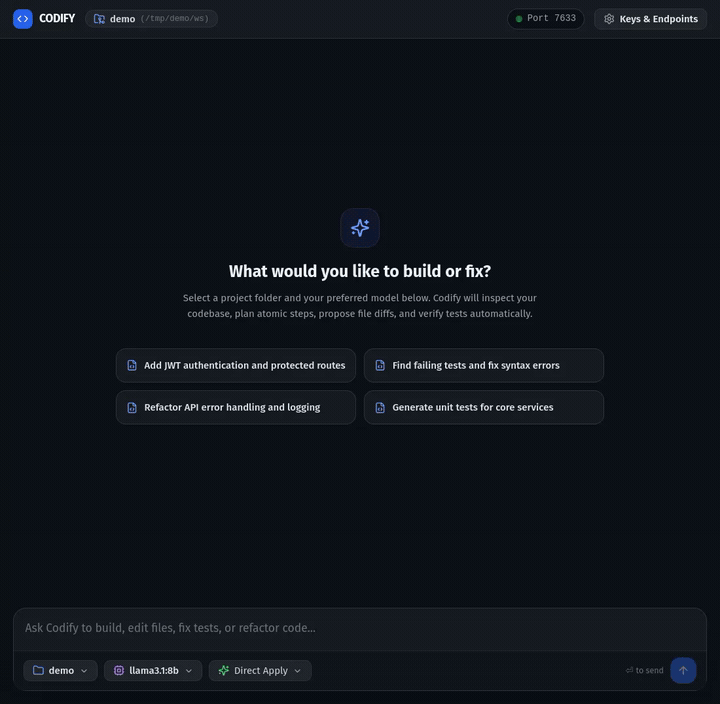

# Codify

**Codify** is a local-first, multi-agent AI coding assistant and desktop application. It decomposes high-level software engineering goals into an atomic, verified execution plan using an orchestrated pipeline of specialized subagents, sandboxed test execution, git integration, and real-time telemetry.

<p align="center">
  
</p>

<sub>Live goal in the chat: reconnaissance → plan → diff → verify → commit. Click through to <a href="docs/demo.webm">docs/demo.webm</a> for the full-quality video.</sub>

---

## 🏛️ Architecture

Codify follows a strict two-tier architecture:

```
┌─────────────────────────────────────────────────────────────┐
│                    Codify Desktop App                       │
│  ┌─────────────────────────┐   ┌─────────────────────────┐  │
│  │  React 19 + TypeScript  │◄──┤      Tauri v2 Core      │  │
│  │   Tailwind CSS / Vite   │──►│   (Rust Subprocess Host)│  │
│  └─────────────────────────┘   └────────────┬────────────┘  │
└─────────────────────────────────────────────┼───────────────┘
                                              │ Spawns & supervises
                                              ▼ (Stdout Handshake)
┌─────────────────────────────────────────────────────────────┐
│                    Codify Engine Backend                    │
│  ┌───────────────────────────────────────────────────────┐  │
│  │  FastAPI (127.0.0.1:7430-7440, Bearer Auth Token)     │  │
│  └──────────────────────────┬────────────────────────────┘  │
│                             │                               │
│  ┌──────────────────────────┴────────────────────────────┐  │
│  │     Laya System-1 Gate  (typed decisions, ~33 ms)     │  │
│  │  intent · risk · prompt-injection → block before LLMs │  │
│  └──────────────────────────┬────────────────────────────┘  │
│  ┌──────────────────────────┴────────────────────────────┐  │
│  │       Subagent Orchestrator (7 pipeline stages)       │  │
│  │  Librarian ─► Design ─► Planner ─► [ Fixer ─►         │  │
│  │   read only    direction  no tools    writer          │  │
│  │                       Verifier ─► Critic ─► Scribe ]  │  │
│  │                        runs         judge     record  │  │
│  └──────┬──────────────────────┬─────────────────────────┘  │
│         ▼                      ▼                            │
│  ┌──────────────┐       ┌──────────────┐     ┌───────────┐  │
│  │ FileSystem   │       │ Sandbox      │     │ Git       │  │
│  │ Service      │       │ Service      │     │ Service   │  │
│  │ (Path Jails) │       │ (Allowlist)  │     │ (Commits) │  │
│  └──────────────┘       └──────────────┘     └───────────┘  │
│         │                      │                            │
│         ▼                      ▼                            │
│  SQLite (WAL Mode)       Local OS Keyring                   │
└─────────────────────────────────────────────────────────────┘
```

### Model discovery — no catalog in the build

Codify ships **no model list**. Models are discovered live from each configured provider's own API
(OpenAI-compatible `/models`, Anthropic `/v1/models`, Google `/models`, Ollama `/api/tags`), using
that provider's stored credential. Saving an API key is enough to see its models; a model the provider
starts serving later appears the next time the app opens (or on **Refresh**), with no upgrade. Every
provider reports its own status, so one invalid key never empties the picker. Settings also flags any
role whose stored model its provider no longer reports — a retired id surfaces while you are looking
at the setting instead of failing mid-goal. The pickers then order what they found by what the app
already knows: models your roles run lead, then the models that actually answered recently (read from
the engine's own `agent_assigned` events — not the model the command bar asked for), then each
provider, with ids the provider reports as non-chat badged and pushed last. Nothing is hidden, and
both pickers use the same signals. See [`docs/06-model-discovery.md`](docs/06-model-discovery.md).

### A fallback target per role — a goal that outlives one provider

Every role can name a **second** target: a provider and a model to call when the primary cannot be
used at all — no key stored, the endpoint down, the model retired, or a reply the contract cannot
parse. It is set per role (Settings → Agent Roles → *Add a fallback*), because the honest fallback
differs by job: a local model is fine for the scribe and a bad idea for the fixer. The role's
temperature and max tokens apply to both targets, since they describe the job rather than the model.

It is tried **once per call, and only for the failures above** — a failure outside that list is a
binding bug, and quietly running it somewhere else is how a real defect gets buried. When it happens the
chat says so (`planner fell back to ollama/qwen3:8b — anthropic/claude-opus-5 could not be used`), so an
answer is never credited to the model that did not produce it. If both targets fail, the error names
them both, with the code each failed under. See [`docs/04` §4.6](docs/04-engine-data-and-runtime.md).

### "Fix the roles that can't run" — one action, no collateral

A migrated or half-configured install leaves roles stranded: some with no model chosen, some on a
provider whose key was never stored, some on an id the provider has since retired. **Agent Roles**
carries one action that points exactly those roles at a model the engine has already discovered, and
leaves every role that works alone — unlike **Apply to all**, which deliberately overwrites all of them.
It reports the reason for each role it changed *and* for each it skipped, so a green result and a
narrow result are distinguishable. A provider that failed to answer is treated as unknown rather than
broken, so a network hiccup can never be reported as *"your model was retired"*.

### "Why did this fail?" — diagnosis instead of guesswork

When a goal fails, the chat's error block names the responsible role and offers a **Why did this fail?**
action. It reads that role's stored config, its provider's credential state, and the provider's live
discovered catalog, then ranks what it found so the cause leads and its symptoms follow — a missing key
is reported as a missing key, not as an unreachable provider. A failed discovery proves nothing, so it
is never dressed up as *"your model was retired"*. Every finding that has a fix links straight to the
screen that holds it: **Add a key for openai** opens Provider Keys, **Choose a current model** opens
that role's card in Agent Roles.

### The System-1 Gate + 7 Pipeline Roles

Before any LLM is called, every goal passes a **pre-flight gate**: [Laya](https://github.com/NandhaKishorM/laya),
a non-generative decision engine that answers typed questions (`choice` / `score` / `noul`) about the
request in a single forward pass — intent, risk, and a **calibrated** prompt-injection probability.
Injection at `≥ 0.85` fails the goal before the planner runs; softer signals only warn. See
[`docs/05-laya-system-1-gate.md`](docs/05-laya-system-1-gate.md).

Then Codify runs a sequential subagent pipeline over 7 stages. Together with the gate that is
**8 roles** (`laya`, `librarian`, `design`, `planner`, `fixer`, `verifier`, `critic`, `scribe` — see
`engine/models.py` `ROLES`). Independent steps of a `parallel` goal run concurrently, bounded by the
configurable parallel width (default 4, `parallel_width` setting, 1–16 — see `engine/executor.py`
`DEFAULT_PARALLEL_WIDTH`), not by a slot count. Each role is a **different ability**, enforced by the
engine rather than requested of the prompt:

| Role | Runs | Ability | Responsibility |
|---|---|---|---|
| **Laya** (gate) | once per goal, before any model call | typed decisions | Intent, risk, prompt-injection / sandbox-escape probability. Blocks high-confidence hostile requests; never writes files. |
| **Librarian** | once per goal, before planning | **read only** — files, literal search, git history, inspect commands | Reads the workspace and returns a checked evidence pack: paths it actually opened, conventions, the command this repo really runs, risks. Paths it never opened are dropped and logged. |
| **Design** | once per goal, after the librarian | reasons only, no tools | Locks the direction the rest of the goal is built against: artifact, design system, tokens, components, constraints, and what makes the result right. Obeys the workspace's **brand contract** when it has one (pinned, or a `DESIGN.md` found at the root) and otherwise proposes one, emitting the `DESIGN.md` body as text for the fixer to write — it never writes a file itself. |
| **Planner** | once per goal | reasons only, no tools | Decomposes the goal plus the evidence pack into 1–20 actionable steps with target paths. |
| **Fixer** | once per step | **the only writer** | Proposes concrete file creates, updates, or deletions. Matching the evidence pack's conventions is part of the job. |
| **Verifier** | once per step | **the only role that runs a command** | Runs one allowlisted command and reports what actually happened (`ran`, `refused`, exit code), or says `skip` when nothing could run. |
| **Critic** | once per step | judgement only | Audits the diff against the request. `request-changes` pauses the step for a human — there is no auto-fix loop. |
| **Scribe** | once per step | wording only | Human-readable progress notes and a conventional commit message. |

Why a librarian exists: without it the planner received a title and a description *and nothing else*,
and the fixer read only the paths that blind planner guessed — so a wrong guess meant no agent ever saw
the right file. See [`docs/01`](docs/01-subagent-orchestration-spec.md) §1.1 and
[`docs/04`](docs/04-engine-data-and-runtime.md) §4.0.

Why a design agent exists: the same failure one level up. With no locked direction, every step
invented its own palette, type scale and component names, so a multi-step UI goal drifted step to
step — the first step's `#2f81f7` and the fourth step's `#3b82f6` were both "the accent". One contract,
decided once and published (`design_contract`), is handed to the planner, the fixer and the critic, so
the direction is something a step can be judged against instead of remembered. A goal whose reply says
it changes no rendered surface (`applies: false`) gets no contract and the pipeline continues — and a
design call that fails at all is a warning, never a failed goal. See
[`docs/04`](docs/04-engine-data-and-runtime.md) §4.0a.

**The repository's own brand wins.** A workspace can **pin** the file that documents it (the palette
button in the workspace picker, `PUT /workspaces/{id}/design-contract`), and failing that a `DESIGN.md`
at the workspace root is found on its own — zero-config, because a repo that already documents its
brand should not have to be told twice. The engine hands the file over in full and marks it binding,
then makes two things its own fact rather than the model's claim: the published `source` is the path
it resolved, and the `design_md` body is dropped, so a goal cannot answer a contract that exists by
writing a second one over it. A pin whose file has since vanished says so and falls back to proposing
— it never silently stops applying, and it never fails the goal.

**A goal can write that file instead.** The `Design Deliverable` toggle on the command bar sends the
goal in **design mode**: the design agent authors the workspace's `DESIGN.md` — a first draft when
there is none, a revision when there is — a planned step writes it verbatim, and the critic reviews
the written file before anything is offered to pin. Review before authority: the pin is still the
user's click on the run's own transcript card, and nothing in the engine ever sets it from a model's
output. See [`docs/04`](docs/04-engine-data-and-runtime.md) §4.0a.2.

---

## 🔒 Security & Invariants

1. **Loopback Only**: The engine binds strictly to `127.0.0.1` on ports `7430–7440`.
2. **Boot Token**: The engine uses a 32-byte CSPRNG token (`CODIFY_ENGINE token=<hex> port=<int>`), and all HTTP and WebSocket requests require `Authorization: Bearer <token>`. It is created once per state directory and kept at `~/.codify/boot_token` (`0600`) so a client stays authenticated across engine restarts — a per-boot token locked out anything that had cached one, and only the desktop shell could recover by re-reading the handshake. `CODIFY_BOOT_TOKEN` overrides it.
3. **Workspace Path Containment**: All file operations verify paths with realpath containment (`FileSystemService.resolve`). Path escapes outside workspace roots raise `PathEscapeError`.
4. **Command Sandboxing**: Shell commands pass through `SandboxService`, which strictly enforces an allowlisted binary set (`pytest`, `python`/`python3 -m pytest`, `npm test`, `pnpm test`, `cargo test`, `go test`, and read-only `git status`/`diff`/`log -1`). The librarian's commands use the same validator in `read_only` mode (`ls`, `wc`, a read-only git subcommand allowlist), so a reconnaissance request can never change the workspace.
5. **Human-in-the-Loop Rejection**: When the Critic requests changes, the step halts in `IN_PROGRESS` with review notes and the goal transitions to `PAUSED`. Execution resumes only when a human user reviews and explicitly triggers a retry.
6. **Key Storage**: API keys are never written to SQLite and never echoed back by the API. They go to the platform's OS keychain (`keyring` / Linux Secret Service / macOS Keychain / Windows Credential Manager) when one is usable, and otherwise to an owner-only `~/.codify/secrets.json` (`0600`, atomic writes) — because a machine without a keyring must still be able to store a key. The settings screen states which store is in force (`GET /settings/keys` → `storage`).
7. **Commit Scope**: A step commits *only* the paths it wrote (`git commit -- <paths>`). The engine never runs a bare `git add -A`, so work you had staged or half-finished in the same tree is neither committed under Codify's message nor staged by it. A step that changed nothing (the proposal matched the file already) commits nothing and says so in the chat rather than claiming a change.
8. **Pre-Flight Gate**: Every goal is triaged by Laya before the planner runs. A calibrated prompt-injection / sandbox-escape probability at or above `0.85` fails the goal with code `laya_blocked` — no plan steps, no provider calls, no file operations. The gate reports which engine decided (`sdk`, `llm-fallback`, or `skipped`) and is never allowed to be a silent failure: an unavailable gate logs that it was skipped and the pipeline proceeds.

---

## 🚀 Quickstart

### Prerequisites

- **Python**: 3.10+ (tested up to 3.14) — the engine is booted as `python3 -m engine`, so this is a
  real deployment floor, not a formality
- **Node.js**: 18+ to build the UI (tested with Node 20 / 26); **22.6+** to run the UI test suite,
  which `make test-ui` executes with `node --experimental-strip-types`
- **Rust / Cargo**: 1.77+ (for desktop shell)

### Setup & Installation

```bash
# Clone the repository
git clone https://github.com/GeneticxCln/Codify.git
cd Codify

# Install Python dependencies
pip install -r engine/requirements.txt

# Install UI dependencies
cd ui && npm install && cd ..
```

### Running All Verifications

```bash
make check
```
This executes:
1. `ruff check engine tests scripts` — the Python linter, with its rule set and target Python pinned in
   `pyproject.toml` (`make lint`)
2. `mypy` over the same files — static type checking with its config (the 3.10 floor, the pydantic
   plugin) pinned in `pyproject.toml` (`make typecheck`)
3. The React/TypeScript unit tests in `ui/tests/` (`make test-ui`)
4. Full Python test suite (411 unit & integration tests — the number moves; trust the run)
5. The concurrency/stream-isolation tests explicitly, by name (`make test-streams`)
6. UI TypeScript validation and Vite production build
7. Tauri Rust crate typecheck via `cargo check`, plus `cargo fmt --check`

The gate is `make ci`, which covers every toolchain:

```
make ci
```

`make check` only ever runs the interpreter you have installed, so `make ci` runs the same Python
targets again on the **declared minimum (3.10)** — fetching that interpreter on demand (`uv`, or a
`python3.10` you already have) instead of skipping the leg — with the UI and stable-Rust legs riding
along in the same pass. 3.10 matters: a construct that only 3.12+ parses is invisible on a modern
interpreter and fatal on the declared minimum.

Run `make hooks` once per clone and the cheap checks (lint, typecheck) run at commit time, with the
full gate running before every push.

See [CONTRIBUTING.md](CONTRIBUTING.md) for the rules of the road — what needs a
test, where the isolation guarantees live, and how to run hermetically.

### Launching the Application

#### Option A: Tauri Desktop App
```bash
cd src-tauri
cargo run
```

> **Bundled app requires Python 3.10+.** The Tauri shell does not embed the
> engine: at startup it spawns `python3 -m engine` from the project root and
> reads the `CODIFY_ENGINE token=… port=…` handshake from its stdout
> (see `src-tauri/src/lib.rs` `launch_engine`). A packaged `.AppImage`/`.dmg`
> therefore needs a system Python 3.10+ with the engine dependencies installed
> (`pip install -r engine/requirements.txt`) — otherwise the window opens with
> no engine behind it.

#### Option B: Standalone Engine + Vite Dev Server
```bash
# Terminal 1: Run engine
python3 -m engine

# Terminal 2: Run web frontend
make dev-ui
```

#### Hermetic scratch run (never touches your real `~/.codify`)

```bash
make run-engine-scratch          # state under /tmp/codify-scratch
CODIFY_HOME=/tmp/anything python3 -m engine
```

`CODIFY_HOME` moves **both** stores — the SQLite database and the secrets file — and, because a run
pointed at its own store must not be able to reach the real one, it also disables the OS keychain for
that process. The engine prints where its state lands on stderr at boot, and names the half-redirected
case (`CODIFY_DB` set without `CODIFY_HOME`, where credentials would still resolve to the real store)
as a warning rather than leaving it implicit. Use this for smoke tests, screenshots and verification
runs; a plain `python3 -m engine` is the only thing that ever opens `~/.codify`.

---

## 📂 Project Structure

```
Codify/
├── engine/                # FastAPI backend & orchestration engine
│   ├── app.py             # FastAPI routes, WebSocket handler & lifespan
│   ├── executor.py        # Gate + 6-stage pipeline execution & state transitions
│   ├── laya.py            # Laya System-1 pre-flight gate (SDK + LLM fallback)
│   ├── models.py          # Pydantic domain models & schemas
│   ├── providers.py       # LLM provider implementations (Anthropic, OpenAI, Gemini, Ollama)
│   ├── services.py        # Workspace, Goal, Event, and Registry services
│   ├── sandbox.py         # Command execution sandbox & argv validation
│   ├── fs.py              # Path containment & atomic file operations
│   ├── git.py             # Git repository detection and commits
│   ├── model_catalog.py   # Live model discovery per provider (no hardcoded lists)
│   ├── db.py              # SQLite connection, WAL configuration, and seeders
│   ├── home.py            # Where state lives (CODIFY_HOME) + the isolated-run guarantee
│   └── default_prompts.py # System prompts for all 8 roles
├── ui/                    # React 19 + TypeScript desktop frontend
│   ├── src/
│   │   ├── components/    # ChatTimeline, BottomCommandBar, SettingsModal, AgentConfigCard, …
│   │   ├── hooks/         # useAgentConfigs hook
│   │   ├── api.ts         # Tauri IPC & HTTP fallback client
│   │   └── types.ts       # TypeScript type definitions
│   └── vite.config.ts     # Vite configuration
├── src-tauri/             # Tauri v2 desktop application shell
│   ├── src/
│   │   ├── lib.rs         # Subprocess supervisor & IPC command handlers
│   │   └── main.rs        # Application entry point
│   ├── tauri.conf.json    # Tauri configuration & capabilities
│   └── Cargo.toml         # Rust dependencies
├── tests/                 # Comprehensive test suite (22 modules, incl. the minimum-Python syntax guard)
│   ├── test_api.py        # HTTP & WebSocket route integration tests
│   ├── test_apply_flow.py # Dry-run → apply flow, guards & status events
│   ├── test_laya.py       # Gate policy, engines, and the block path
│   ├── test_model_catalog.py # Per-protocol discovery, caching, failure isolation
│   ├── test_executor.py   # Full multi-agent execution pipeline tests
│   ├── test_fs.py         # File system jail & diffing unit tests
│   ├── test_git.py        # Git integration tests
│   ├── test_sandbox.py    # Sandbox argv allowlist security tests
│   ├── test_home.py       # State paths & isolation (a scratch run cannot reach ~/.codify)
│   └── test_db_and_services.py # Database & service layer unit tests
├── docs/                  # Architecture specifications & protocols
├── Makefile               # Development, build, and test automation
└── pyproject.toml         # Python packaging configuration
```

---

## 🧪 Testing

Run the test suite with:

```bash
# Via Makefile
make test

# Or directly with Python unittest
python3 -m unittest discover -s tests -p "test_*.py" -v
```

The Python suite runs in ~37s without external network calls, using deterministic mock providers and
in-memory/temporary databases; `make test-ui` adds the TypeScript tests in `ui/tests/`.

The suite is **hermetic by construction**: `tests/hermetic.py` points every test at a throwaway state
directory and disables the OS keychain for the process, so no test — including the ones that build a
`Keychain()` exactly as the engine does — can read or write your real `~/.codify`. Two tests assert
that guarantee, so removing the bootstrap fails the suite rather than silently rewriting a real store.

---

## 📄 License

MIT License. See [LICENSE](LICENSE) for details.
