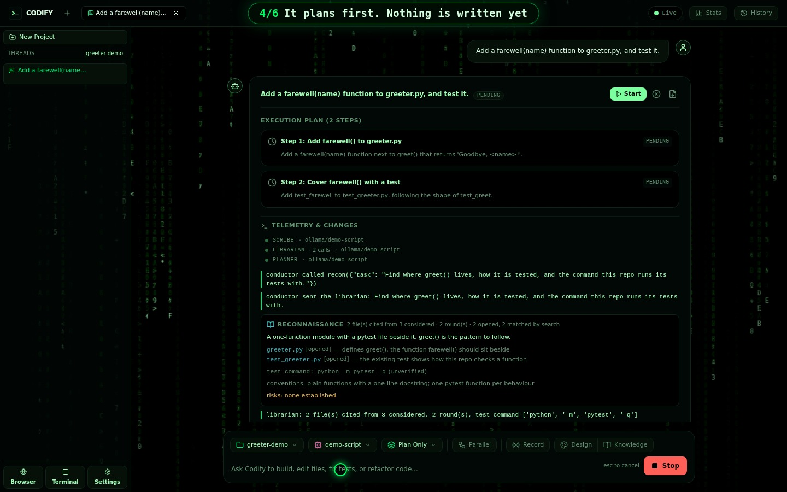
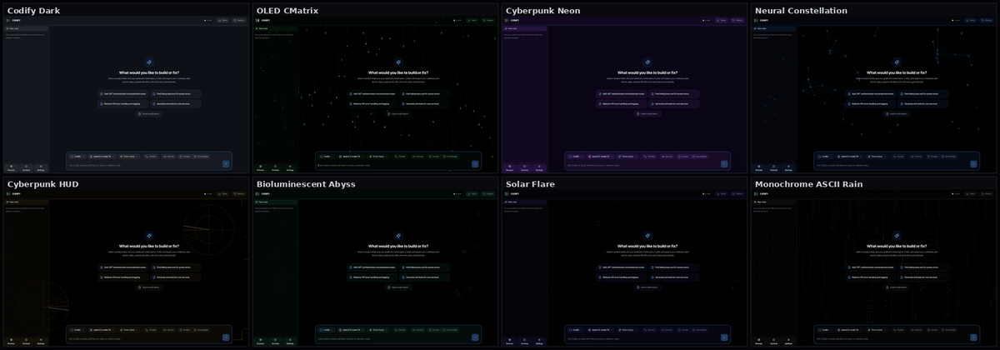

<div align="center">


# Codify

**A local-first, multi-agent coding assistant.**<br>
It plans, you approve, and every change is verified and committed on its own.

[](https://github.com/GeneticxCln/Codify/actions/workflows/check.yml)


[](LICENSE)

<br>

<a href="docs/media/demo.mp4">
  <picture>
    <source srcset="docs/media/demo.webp" type="image/webp">
    
  </picture>
</a>

<sub><b>The real app in the OLED CMatrix theme</b>, from choosing <b>Plan Only</b> to two verified commits. Parts of the
animation are sped up and carry a speed badge; <a href="docs/media/demo.mp4">the full-length MP4</a> is real time.
<a href="#-see-it-work">What is real in this clip, and what is scripted</a>.</sub>

<br>

[Quickstart](#-quickstart) ·
[How it works](#-how-it-works) ·
[Themes](#-appearance) ·
[Voice](#-voice) ·
[Security](#-security--invariants) ·
[Documentation](#-documentation)

</div>

---

**Codify** turns a plain-language request into a plan, waits for your approval, and then carries it out with
specialised subagents: a pre-flight gate, a librarian that reads your code, a planner, and a fixer, verifier,
critic and scribe that work one step at a time. Commands run in an allowlisted sandbox, each step is committed on
its own with only the files it wrote, and every stage streams live into a desktop app.

- **Plan first.** A gate rules on every request before any model is called. In **Plan Only** mode nothing is
  written until you press **Start**, and that is enforced by the engine's write gate, not by the UI.
- **Verified, not asserted.** The verifier runs your project's own tests, the critic audits the diff, and a step
  that fails goes back instead of forward.
- **Scoped commits.** A step commits *only* the paths it wrote. The engine never runs a bare `git add -A`.
- **Local-first.** The engine binds `127.0.0.1` behind a boot token, and API keys never reach SQLite or an API
  response. Run it on a local model, or point any role at a hosted one.
- **Your models, discovered live.** Eight providers are built in (Anthropic, OpenAI, Google, DeepSeek,
  OpenRouter, Groq, NVIDIA and Ollama) and any OpenAI-compatible or Ollama-style endpoint can be added. Codify
  ships no model list.
- **Nineteen themes**, including the one in the clip, swapped at runtime with no rebuild.

Everything below is specified in [`docs/`](docs/00-codify-architecture-overview.md). That set is the source of
truth; this file is the tour.

---

## 🎬 See it work

The clip is one request, start to finish, in the **OLED CMatrix** theme:

1. **Choose a mode.** *Plan Only* shows the plan and waits for you.
2. **Ask** in plain language: *"Add a farewell(name) function to greeter.py, and test it."*
3. **The gate rules, the librarian reads.** It opens `greeter.py` and `test_greeter.py`, and reports what it
   actually opened.
4. **A two-step plan**, and nothing has been written yet.
5. **Start.** For each step the fixer writes, the verifier runs `python -m pytest -q` in the sandbox, the critic
   reviews, and the scribe commits.
6. **Two commits**, `feat(greeter): add farewell()` and `test(greeter): cover farewell()`, each touching only its
   own file.

**What is real, and what is not.** It was recorded from the browser build of the UI (the same React app the
desktop shell loads), against a real engine on a scratch state directory: the gate, the conductor loop, the
write gate, the sandbox running pytest, the scoped git commits and every event on screen are the real thing.
**The model's replies are scripted**, so the clip is reproducible offline and takes no API key; a real model
decides differently and takes longer. The MP4 is real time and unedited. The animation above is the same recording with
the waiting cut down, and every sped-up stretch carries a badge.

---

## 🚀 Quickstart

Ask the machine what it needs. A list of versions in prose is where drift lives:

```bash
make doctor     # checks everything below, prints the install command for what is missing
```

It looks for **Python 3.10+** with `venv` (3.10 is a real deployment floor: the shell boots the engine as
`python3 -m engine`), **Node 22.22.2+ / 24.15+ / 26+** (jsdom's range, which the UI suite inherits), **Rust
stable** with `rustfmt` (rustup's default profile includes it, `--profile minimal` does not) and WebKitGTK 4.1,
GTK 3, libsoup 3, librsvg, OpenSSL and `pkg-config`, and a display for the Tauri leg (`xvfb` is used
automatically on a headless machine). **bubblewrap** (`bwrap`) that can actually build a jail, because the machine tab
is a jailed shell and its containment tests start real ones (WebKitGTK's own sandbox already uses it). PipeWire's `pw-record` is optional and only needed for the mic (see
[Voice](#-voice)). It also checks this checkout's `.venv` against
`pyproject.toml`, so a virtualenv made before a dependency was added is reported rather than quietly running.

```bash
git clone https://github.com/GeneticxCln/Codify.git
cd Codify
make setup      # creates .venv, installs the engine and dev tools, runs npm ci
make run-app    # builds the UI, embeds it, launches the app
```

A virtualenv rather than `pip install -r`: stock Ubuntu 24.04, Debian 12+ and Fedora refuse `pip install` into
the system Python (PEP 668). The Makefile and the shell both use `./.venv` when it exists, so nothing has to be
activated.

<details>
<summary><b>Install a launcher, hot reload, or run the engine without the shell</b></summary>

<br>

```bash
make dev-app           # hot reload against the Vite dev server (needs cargo-tauri)
make install-local     # release build, plus a `codify` command and a menu entry
codify                 # from any directory, or from the applications menu
make uninstall-local   # removes exactly those three files
```

Codify targets Linux desktops and ships **no installer or AppImage**. Everything lands under your own `~/.local`;
no root is involved. **Moving or deleting the checkout breaks the entry**, because the launcher finds the project
root from where it lives.

> **Do not launch it with a bare `cargo run`.** That is a *dev* build: the window loads `http://localhost:5173`
> and shows a connection error unless a Vite dev server is already running, which looks exactly like an app whose
> panes are not wired.

> **The app needs the checkout and a Python 3.10+ with the engine's dependencies.** The shell spawns
> `python3 -m engine` in the project root and reads the `CODIFY_ENGINE token=… port=…` handshake from its stdout.
> If no engine is found the window says so rather than opening empty.

**If the window opens blank or black** (WebKitGTK 4.1 quirks, none of which apply on a normal GNOME or KDE
session): try `WEBKIT_DISABLE_DMABUF_RENDERER=1 codify` on some NVIDIA/Wayland combinations, or
`GDK_BACKEND=x11 codify` to go through XWayland.

**Checked on a real display, by hand** (the maintainer, not CI), on both Wayland and X11: CachyOS under Niri, a
Wayland compositor, and X11 through its XWayland. The window renders without graphical artifacts, the folder picker
opens the native XDG desktop portal dialog when `codify` is run from the project's `.venv`, and the `.desktop` entry
launches the app from the desktop launcher. It has not been run on GNOME or KDE.

**Engine without the shell**, for UI work:

```bash
make run-engine-preview   # terminal 1: starts the engine and prints the token and port
make dev-ui               # terminal 2: the standalone browser build
```

A browser tab has no shell to ask for a boot token, so it needs one pasted into the console once; the app tells
you the exact two `localStorage` lines when it needs them.

**Never touches your real `~/.codify`:** `CODIFY_HOME=/tmp/anything python3 -m engine` moves both the database
and the secrets file, and disables the OS keychain for that process, so a run pointed at its own store cannot
reach the real one.

</details>

---

## 🏛️ How it works

```
┌─────────────────────────────────────────────────────────────┐
│                    Codify Desktop App                       │
│  ┌─────────────────────────┐   ┌─────────────────────────┐  │
│  │  React 19 + TypeScript  │◄──┤      Tauri v2 Core      │  │
│  │   Tailwind CSS / Vite   │──►│   (Rust Subprocess Host)│  │
│  └─────────────────────────┘   └────────────┬────────────┘  │
└─────────────────────────────────────────────┼───────────────┘
                                              │ Spawns & supervises
                                              ▼ (Stdout Handshake)
┌─────────────────────────────────────────────────────────────┐
│                    Codify Engine Backend                    │
│  FastAPI (127.0.0.1:7430-7440, Bearer boot token)          │
│    │                                                        │
│    ├─ Laya System-1 gate — typed decisions, before any LLM  │
│    └─ Conductor loop — picks from 7 role slots              │
│       via moves + a loaded skill                            │
│       │                                                     │
│  ┌────┴─────────┬──────────────┬────────────┐  ┌─────────┐  │
│  │ FileSystem   │ Sandbox      │ Git        │  │ SQLite  │  │
│  │ (path jails) │ (allowlist)  │ (commits)  │  │  WAL    │  │
│  └──────────────┴──────────────┴────────────┘  └─────────┘  │
└─────────────────────────────────────────────────────────────┘
```

The component list behind that diagram and the invariants the engine holds to are in
[`docs/00`](docs/00-codify-architecture-overview.md). Read it before changing either tier.

### Eight roles, and a loop that orders them

A **pre-flight gate** rules on every goal before any model is called, then a **conductor** decides which of the
remaining seven roles run and in what order.

| Role | Runs | Ability |
|---|---|---|
| **Laya** (gate) | once per goal, before any model call | Typed decisions: intent, risk, calibrated prompt-injection. Blocks hostile requests; never writes files. |
| **Librarian** | once per goal, before planning (`recon`) | **Read only**: files, search, git history. Returns a checked evidence pack: paths it actually opened, conventions, the command this repo really runs. |
| **Design** | once per goal (`design`) | Reasons only. Locks the direction (tokens, components, constraints), obeying the workspace's brand contract when it has one. Emits the contract as text; never writes it. |
| **Planner** | once per goal (`plan`) | Reasons only. Decomposes goal + evidence into 1–20 steps with target paths. |
| **Fixer** | once per step (`write`) | **The only writer.** Proposes file creates, updates, deletions. |
| **Verifier** | once per step (`verify`) | **The only role that runs a command.** One allowlisted command; reports what actually happened. |
| **Critic** | once per step (`review`) | Audits the diff. `request-changes` pauses for a human; there is no auto-fix loop. |
| **Scribe** | once per step (`summarize`) | Progress notes and a conventional commit message. |

The familiar librarian → design → planner → fixer → verifier → critic → scribe order is the built-in
`ship-a-change` **skill**, not a compiled path: a request needing three of those seven gets three. The slot count
is fixed; the order is not. Independent steps of a `parallel` goal run concurrently, bounded by a configurable
width. See [`docs/01`](docs/01-subagent-orchestration-spec.md), [`docs/05`](docs/05-laya-system-1-gate.md).

The conductor is the only thing that drives an approved plan, one step at a time, and it has a few small tools of its own
that are not new powers: it keeps short **notes for its next run** of a step (`todo`: a note it writes to itself, shown
back as *its own notes, not instructions*, never shown to another agent), and, before there is a plan, it can put **one
question to you with options you can click** (`ask_user`). Your answer is just your next message, an ordinary turn,
and the question is not offered once there is a plan or while an approved plan is running. A skill may say which moves
it is written around; that is a hint and never a grant. [`docs/09`](docs/09-workspace-shell.md) §10.6, §10.19.
Ruflo, the agent harness this was measured against, is audited in [`docs/11`](docs/11-ruflo-audit.md): most of it is
refused by an invariant, and the page says which and what it did not read.

### Model discovery: no catalog in the build

Codify ships **no model list**. Models are discovered live from each provider's own API, using that provider's
stored credential. Saving a key is enough to see its models; one the provider starts serving later appears on
**Refresh**, with no upgrade. Every provider reports its own status, so one invalid key never empties the picker,
and a role whose stored model its provider no longer reports is flagged while you are looking at the setting
rather than mid-goal. See [`docs/06`](docs/06-model-discovery.md).

### A fallback per role, and a diagnosis when it is used

Every role can name a second target (provider and model) for when the primary cannot be used at all. It is per
role because the honest fallback differs by job: a local model is fine for the scribe and a bad idea for the
fixer. It is tried once per call and only for those failures; anything else is a binding bug, and the chat names
the model that actually answered.

**Fix the roles that can't run** is one action that points exactly the stranded roles at a model the engine has
already discovered, and leaves every working role alone. It reports the reason for each role it changed *and* each
it skipped, and a provider that merely failed to answer is treated as unknown rather than broken, so a network
hiccup is never reported as *"your model was retired"*.

Settings is the **only** place a role's provider and model can change, enforced at three layers rather than by
convention: the API exposes exactly one mutator, the Tauri layer one command, and every other surface renders a
role's config as text it can deep-link from but not edit. See [`docs/02`](docs/02-settings-app-spec.md).

When a goal fails, the error block offers **Why did this fail?**: it reads the role's config, its credential state
and the provider's live catalog, then ranks cause above symptom. A missing key is reported as a missing key, not
as an unreachable provider, and every finding links to the screen that fixes it. See
[`docs/04`](docs/04-engine-data-and-runtime.md).

### Memory, and a browser the model can read

`recall` lets the conductor ask this workspace's own history a question (*has this happened here before, and did
we get past it?*), returning the specific past events, newest first. It is bounded and allow-listed: only named
fields from named event types, never stored diffs or third-party text, and results arrive labelled *recorded
outcomes, not evidence about the current code*. What the brief tells the conductor unprompted fades with age (a
lesson's weight halves every 30 days since the failure was last seen, and it drops out under a floor), so a failure
fixed last year is not presented as this workspace's history; `recall` still finds it if asked.
See [`docs/10`](docs/10-agent-memory.md).

Pages open **inside** Codify, as a real embedded webview, and the same tab is readable by the model: `read_page`
returns the address, title, text and links, so a turn can depend on a documentation page instead of guessing.
Loopback stays blocked, and a model-proposed URL meets the same guard your click goes through. See
[`docs/09`](docs/09-workspace-shell.md).

The conductor can also **fetch a public page itself** (`fetch_page`), without moving your tab, but only if you turn it on
in Settings → Web pages: off by default, then either only the sites you list or any public site. It reads the page with
[Scrapling](https://github.com/D4Vinci/Scrapling)'s parser and nothing else of Scrapling: the request is Codify's own,
public addresses only, bounded, and announced in the transcript before it is made. The address is sent to the site and
can carry whatever the assistant has read, which no rule can prevent, so the list is the safer setting. See
[`docs/12`](docs/12-scrapling-audit.md).

For a security review, the conductor has a scanner of its own, `scan_code`: curated rule profiles (secrets, injection,
crypto, deserialization, unsafe C, web) run over the workspace with comments and test files skipped, returning ranked
**candidates** at `path:line`, with what it did not look at stated. A workspace can add its own profiles in
`.codify/profiles/`, as data and never as a capability. The built-in `security-review` skill has the model read each hit
before it calls it real, and fixes still go through a plan you approve. It is the idea of NCC Group's Grepify built
natively, with none of its code. See [`docs/13`](docs/13-grepify-audit.md).

---

## 🎨 Appearance

Nineteen themes ship in the box, and choosing one is a **runtime swap, not a rebuild**: a theme is a map of CSS
custom properties, so the whole app repaints with no component change and no restart.

<p align="center">
  
</p>

<sub>All nineteen at once: seventeen of them with an animated backdrop of their own, and two (<b>Codify Dark</b> and <b>Still</b>) that ship no canvas at all. <b>OLED CMatrix</b> is the pure-black one with the green rain, and the one in the clip above.</sub>

| Theme | What it is |
|---|---|
| **Codify Dark** | The default contract: blue-grey surfaces, green reserved for status. No canvas. |
| **OLED CMatrix** | Pure black, with the rain drawn in `#003300`: the clip at the top of this page. |
| **Cyberpunk Neon** | Violet-black, a neon horizon grid and a banded sun in cyan and magenta, under a CRT veil. |
| **Neural Constellation** | A slow web of nodes that brightens and pulses while the agent is working. |
| **Cyberpunk HUD** | Amber instrumentation: corner brackets, two slow radar sweeps, a tick ladder. |
| **Bioluminescent Abyss** | Spores rising in the left and right gutters, fading out before the middle. |
| **Solar Flare** | A starfield and slow indigo-to-ultraviolet streams along the window's edges. |
| **Monochrome ASCII Rain** | The same rain in hex bytes and grey: no component of its own, just different tokens. |
| **Still** | No canvas at all. For long sessions, and for anyone who would rather have no weather than quiet weather. |
| **Winter Snow** | A clear cold night, and snow falling through the whole window. No lights, just weather. |
| **Festive Night** | Evergreen dark, gold and berry, and warm lights drifting up through the snow. |
| **Solarized Flare** | A monochrome amber CRT. Solar wind runs the gutters, and a heat pulse crosses them while a run is in flight. |
| **Cyber Organism** | Electric blue and cyan. Glowing nodes and branching tendrils in the margins, firing while a run is in flight. |
| **Event Horizon** | Obsidian and violet. Orbital streams curve away at the margins, and beams ignite while a run is in flight. |
| **Vector Wireframe** | Green or hot pink 1px line art. Rotating wireframe solids in the gutters, with a target reticle while a run is in flight. |
| **Liquid Mercury** | Platinum, steel and titanium. Viscous metallic waves climb the margins and go turbulent under load. |
| **Electric Arc** | Ink-blue and a lightning-white core. Arcs strike down both gutters, fork, and go out as fast as they came. |
| **Toxic Lab** | A fume hood at 3am. Reagent-green bubbles climb the gutters, wobble, and burst; failure is the amber the hazard tape is. |
| **Anon Fluid** | Green on black and no name on it. Data runs sideways through the gutters as a liquid column, and a run in flight shears it into blocks. |

Four constraints hold every one of them:

- **A theme is data.** It publishes CSS variables; a backdrop asks whether the active theme published them. The
  last theme added was five lines of tokens and no new code.
- **One clock, one budget.** Every effect runs through `useAtmosphereCanvas`, which owns the canvas size cap, a
  30 FPS accumulator, and exactly one static frame under `prefers-reduced-motion`.
- **Decoration is never under the words being read.** Content surfaces stay opaque and the canvas is masked to
  fade before it reaches the chrome.
- **A theme may restate the status tones; it may not renegotiate them.** All six or none, and `danger` and
  `warning` stay on the warm arc: a user who learned that orange means *needs attention* was owed that much.

The whole window also **scales**: Settings → Appearance → *UI scale* (100 to 175%, **125% by default**), or
`Ctrl +`, `Ctrl -` and `Ctrl 0` from the keyboard. The type ramp and spacing are rem, so text, icons and padding
grow together, and the xterm terminal follows too.

Any theme can be **recoloured without being forked**: the Appearance pane offers each theme's accent plus the
weather variables its own backdrop reads, labelled with what they draw. A proposal is **clamped, not accepted
blindly**: it keeps its hue and saturation and has its lightness moved until it clears 4.5:1, and a colour that
cannot be made readable is refused outright. Schemes export and import as one readable JSON file.

One surface is not reachable by swapping custom properties, and it is the honest exception to *the whole app*:
xterm.js paints its own canvas and takes concrete colour strings. The one surface CSS cannot reach is the one that
needed it. The terminal follows the theme by reading it out of the document: `ui/src/terminalTheme.ts` maps all
twenty of xterm's colours onto variables a theme publishes, and the pane re-reads them on every switch, so a
terminal opened before you changed theme is not left behind. Before that, it was the one grey-blue box in an OLED
app that was otherwise black and phosphor.

---

## 🎙️ Voice

You can speak a prompt instead of typing it, and have answers read back to you.

- **The mic beside Send** puts what you said into the prompt at the caret. It never sends: you still press
  Send. Esc while recording throws the recording away.
- **Read aloud** sits under each answer. Turn on *Read each answer aloud as it arrives* in **Settings → Audio**
  and new answers read themselves. Answers already in a thread you open never do.

Both go through a speech provider you choose in **Settings → Audio**. Any server that speaks the OpenAI audio
API (`/audio/transcriptions`, `/audio/speech`) works:

| Setup | What to choose |
|---|---|
| **Fully local**: nothing leaves the machine | Run a speech server such as speaches or LocalAI on `127.0.0.1`. Choose *Custom Provider…* and give it a slug (`localspeech`) and its **Server address** (`http://127.0.0.1:8000/v1`). It needs no key. |
| **Hosted** | `openai` or `groq`, with its key under **Provider Keys**. |

Model and voice names are the provider's own, and Codify keeps no list of them.

The engine, not the webview, records the microphone, using PipeWire's `pw-record`. It records only while you
dictate, for at most two minutes, and deletes the recording once it has been transcribed. If PipeWire's tools are
missing, `make doctor` says so as a note, not a failure; everything else runs without them. Details:
[docs/09 §9](docs/09-workspace-shell.md), [docs/04 §3.0.2](docs/04-engine-data-and-runtime.md) and
[docs/03 §1.9](docs/03-security-and-roadmap.md).

## Clipboard history

An icon beside **Notifications** in the header opens a history of what you copied, cut or pasted *inside Codify*:
selected text, pastes, a code block's Copy. Each clip can be **copied again**, **inserted into the message box**,
**pasted into the terminal**, pinned or deleted.

- **Inside Codify only.** It does not watch the system clipboard and asks for no permission, so a copy made in
  another application, or in a browser tab, is not in it.
- **Kept in this window, and never sent anywhere.** It is stored in the window's own storage, not the engine or
  its database, and holds the newest 50 clips plus up to 20 pinned.
- **Keys and passwords are never kept.** Anything from a password field, and anything shaped like a key or token
  (`sk-…`, `ghp_…`, a `Bearer` value, a private key block, a long random token), is refused, and the drawer says
  so. That is a heuristic and not a guarantee: delete anything it should have refused.
- **A shell does not run what you did not read.** A multi-line clip is only pasted into a terminal that has asked
  for bracketed paste; otherwise each line would run as soon as it arrived.

Details: [docs/09 §11](docs/09-workspace-shell.md) and [docs/03 §1.10](docs/03-security-and-roadmap.md).

## Split panes

Show a chat beside a terminal, an editor or a browser page, or two of those side by side. Right-click a tab and choose **Show beside the current tab**
(or **Split with a new terminal**), pick **Split** in the command palette (Ctrl+K), or press **Ctrl+.** (again to close).
Drag the divider, or use its arrow keys. Click in a pane to work in it; the tab strip follows.

- **A browser page can be one of the two,** beside a chat, a terminal or an editor. A link in an answer opens beside the answer when there is room.
  Not two pages (each is a native view the shell seats over one rectangle), and not two conversations (they would share one message box); the menu says
  so instead of doing nothing. While you drag the divider, or have the palette or a menu open, the page steps out of the way, because a native view paints
  over everything else. Clicking inside a page moves the split's focus marker to it, like clicking anywhere else in a pane.
- **A narrow window draws one pane.** The left panel gives way first; if two panes still do not fit, the focused one is drawn and the other
  returns when there is room.
- **A split is not remembered across a restart** (terminals are not); the divider's position is.

Details: [docs/09 §12](docs/09-workspace-shell.md).

## Editor

Press **Ctrl+K**, type part of a file's name and pick it: the file opens in its own tab, and **Ctrl+.** puts it beside the
conversation you are in. It is a plain code editor (syntax colours for JavaScript/TypeScript, Python, JSON, Markdown, CSS and HTML;
undo; **Ctrl+S** to save). A change in a run's diff card has an **Open** link to the file it touched.

The assistant can **see** it and **use** it, through three tools it can call on any turn:

- **`read_editor`** reports which files you have open, which one is in front, your cursor and selection, and the text **including
  what you have not saved**.
- **`open_in_editor`** points at a file and a range. It opens beside the chat you are reading, never takes the keyboard from the message
  box you are typing in, and never rearranges a split you made: with no room, or a terminal in front, the tab opens in the background and is marked.
- **`edit_editor`** changes the text in the open buffer, as one undoable step, highlighted until you save.

- **The assistant never saves.** Its edit is unsaved text in your editor, marked as its own; the file on disk changes only when
  *you* press Save. That is the one other way a file is written besides the fixer's approved step, it needs the engine's boot token,
  and no agent, skill or conductor tool can reach it ([invariant 9](docs/00-codify-architecture-overview.md)).
- **It will not overwrite a file that changed under you.** If the fixer or a terminal rewrote it, Save says so and offers *Reload from
  disk* or *Keep my version*.
- **Unsaved text is not restored after a restart,** and closing the window (as opposed to the tab) does not ask. Editors are not remembered, as terminals are not.

Details: [docs/09 §13](docs/09-workspace-shell.md), the routes in [docs/04 §3.0.3](docs/04-engine-data-and-runtime.md).

## Machine

A **Machine** is a Linux shell in a jail, in a tab of its own. Open one from the **Machine** button in the left panel or from the
palette (**Ctrl+K**, "machine"); **Ctrl+.** puts it beside the conversation you are in. It needs **`bubblewrap`** (`make doctor` says
whether it can build a jail on your computer, and how to fix it if not).

It is a jail, **not a virtual machine**: it shares your computer's kernel, and says so.

- **Your project is there as the machine's own copy**, at `/work`. It can edit, build and run tests in it freely, and **your files are never written**: the copy is kept in memory, capped in size, and thrown away with the machine. Nothing leaves except text you select and copy by hand. (Where your computer cannot make the copy, `/work` is read-only instead, and the header says why.)
- **Its home and `/tmp` are scratch** (size-capped memory), thrown away when the machine closes.
- **It cannot run away with your computer.** One process that spins for half an hour of CPU is ended by the kernel; a file past a gigabyte cannot be written; and if everything in the machine adds up to more than its share of your memory (half of it, never more than 4 GB) the machine is stopped, with a line on the screen saying why. That check looks twice a second, so a program that allocates faster than that can overshoot first. Nothing here can stop a bug in the kernel itself: a machine shares your kernel.
- **It has no credentials**: not your home folder, not your keys, not Codify's own state, not the engine's token.
- **It has no network** unless you open it with one (the second row in the palette). That choice is made once and the header says it in words;
  it cannot be switched on later, and the assistant cannot open a machine or change it. **With the network on it shares your computer's
  network**, including services listening on `127.0.0.1`.
- **If a jail cannot be built, nothing starts**: there is no fallback to a plain shell.

The assistant can **see** it and **type into** it, through three tools it can call on any turn:

- **`read_machine`** shows which machines are open, the screen as you see it, and what scrolled off it. It works for a machine in a background tab.
- **`run_in_machine`** types a command, waits for the output to settle, and brings back what it printed. A command that keeps running is not waited for.
- **`key_in_machine`** presses one of twelve named keys (Enter, Tab, Escape, the arrows, Backspace, Ctrl-C, -D, -L, -Z).
- **`reset_machine`** starts the machine again from a clean project, for a machine that is wedged, full, or was stopped. It keeps the network you chose and cannot open a machine. You have the same thing as a **Reset** button in the machine's header, which asks first.

Inside the jail the assistant is **not held to the command allowlist**; the jail is what contains it, and
[invariant 6](docs/00-codify-architecture-overview.md) says so in one sentence. A machine is not remembered: a restart reopens none, and closing the tab ends everything running in it, its copy of your project with it.

**Not in this version:** a graphical desktop or a full virtual machine, a seccomp filter, a kernel-enforced memory limit (it is watched, not capped), snapshots beyond "clean", and any way to copy a file out. The limits are listed in
[docs/09 §14](docs/09-workspace-shell.md), with what was measured in a real jail and what was not, and the claims the jail makes are [docs/03 §1.11](docs/03-security-and-roadmap.md).

---

## 🔒 Security & Invariants

1. **Loopback only.** The engine binds `127.0.0.1` on ports `7430–7440`.
2. **Boot token.** Every HTTP and WS request requires `Authorization: Bearer <token>`, created once per state
   directory and kept at `~/.codify/boot_token` (`0600`) so a client stays authenticated across restarts.
   `CODIFY_BOOT_TOKEN` overrides it.
3. **Path containment.** All file operations verify realpath containment; escapes raise `PathEscapeError`, and a
   workspace root that is your home, a system directory or a credentials directory is refused, so an approved
   goal cannot rewrite `~/.bashrc`.
4. **Command sandboxing.** Commands pass an allowlist (`pytest`, `npm test`, `cargo test`, `go test`, linters and type-checkers
   such as `ruff check`, `mypy`, `tsc --noEmit` and `make lint`, read-only git), and a linter is never handed a flag that
   edits. The librarian's run in `read_only` mode, so reconnaissance can never change the workspace.
5. **Human in the loop.** When the critic requests changes the step pauses and the goal transitions to `PAUSED`;
   only a human resumes it. The same goes for a conductor that cannot finish a step (it ran out of calls, lost its
   model, or stopped): the goal pauses with a stated reason and your Start picks it up at that step. There is no
   second engine pass behind the conductor that quietly finishes it.
6. **Key storage.** Keys never reach SQLite and are never echoed by the API. They go to the OS keyring when one is
   usable, otherwise to an owner-only `~/.codify/secrets.json`, because a machine without a keyring must still be
   able to store a key. The settings screen says which is in force.
7. **Commit scope.** A step commits *only* the paths it wrote (`git commit -- <paths>`). The engine never runs a
   bare `git add -A`, so work you had staged in the same tree is neither committed under Codify's message nor
   staged by it.
8. **The gate is not optional.** Injection probability `≥ 0.85` fails the goal before the planner runs. An
   unavailable gate logs that it was skipped and the pipeline proceeds; it is never a silent failure.

Each is specified with its reasoning in [`docs/03`](docs/03-security-and-roadmap.md).

---

## 🧪 The gate

```bash
make check     # lint, typecheck, UI tests, Python suite, stream isolation, build, cargo
make ci        # the same Python legs again on the declared minimum (3.10)
```

`make check` only ever runs the interpreter you have installed. `make ci` runs the Python legs again on **3.10**,
fetching that interpreter on demand rather than skipping the leg. 3.10 matters: a construct only 3.12+ parses is
invisible on a modern interpreter and fatal on the declared minimum. `.github/workflows/check.yml` runs the same
targets on GitHub's runners for every pull request and every push to `master`: a second opinion from a clean machine.

`make hooks` installs the versioned hooks: the cheap checks at commit time, the full gate before every push. The
suite is **hermetic by construction**: `tests/hermetic.py` points every test at a throwaway state directory and
disables the keychain, and two tests assert that, so removing the bootstrap fails the suite rather than silently
rewriting a real store.

Determinism is structural rather than a matter of discipline: every process the engine, the benchmark harness or
a script starts goes through one spawn guard that makes it die with the process that started it, and a test
freezes that list, so a new spawn cannot appear unannounced. See
[`docs/07`](docs/07-spawn-guard-and-deterministic-tests.md). Benchmark numbers live in a separate harness with an
explicit rule about what one may claim (*does this pipeline still do its job*, never *is the model good*), and it
fails rather than scoring a repository it was not given, so no third-party source is committed here. See
[`docs/08`](docs/08-benchmarks.md).

---

## 📚 Documentation

The specifications are the source of truth; the README summarises them.

| Doc | Read it for |
|---|---|
| [`docs/00`](docs/00-codify-architecture-overview.md) | Architecture overview, the component list, the invariants |
| [`docs/01`](docs/01-subagent-orchestration-spec.md) | Subagent orchestration, roles, `AgentConfig`, providers |
| [`docs/02`](docs/02-settings-app-spec.md) | The settings UI and Tauri layer: the only mutator |
| [`docs/03`](docs/03-security-and-roadmap.md) | Security and roadmap: keyring, SSRF, boot token |
| [`docs/04`](docs/04-engine-data-and-runtime.md) | Workspace, goal, plan-step and event SQL; HTTP and WebSocket; sandbox argv; fallbacks |
| [`docs/05`](docs/05-laya-system-1-gate.md) | The Laya gate and its thresholds |
| [`docs/06`](docs/06-model-discovery.md) | Live model discovery, and why there is no catalog |
| [`docs/07`](docs/07-spawn-guard-and-deterministic-tests.md) | The spawn guard and deterministic tests |
| [`docs/08`](docs/08-benchmarks.md) | Benchmarks: what a number may claim |
| [`docs/09`](docs/09-workspace-shell.md) | The workspace shell: conversations, tabs, panes, the embedded browser, the editor, the machine, what a turn is |
| [`docs/10`](docs/10-agent-memory.md) | Agent memory: what was built, what was rejected |
| [`docs/11`](docs/11-ruflo-audit.md) | The Ruflo audit: which ideas were borrowed, which were refused and why |

## 📂 Layout

```
engine/     FastAPI backend — app.py (routes), conductor.py (the loop), executor.py (+ executor_*.py, its layers),
            laya.py (gate), providers.py, sandbox.py, fs.py, git.py, db.py, watchdog.py
ui/         React 19 + TS + Vite — App.tsx, components/, hooks/, api.ts, appearance.ts
src-tauri/  Tauri v2 Rust shell — lib.rs (supervisor + IPC), browser/ (the embedded pages),
            the render-starvation watchdog
tests/      Python suite; hermetic.py is the shared isolation bootstrap
scripts/    fake_ollama.py, drive_a_turn.py, replay_trace.py, make_logo.py, check_history.py
docs/       00–13, the specifications this README summarises
```

## 📄 License

MIT. See [LICENSE](LICENSE).
