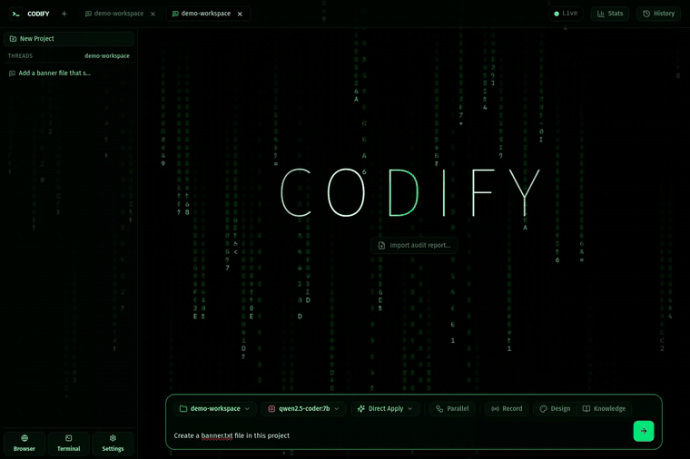

# Codify

**Codify** is a local-first, multi-agent AI coding assistant and desktop application. It decomposes high-level software engineering goals into an atomic, verified execution plan using an orchestrated pipeline of specialized subagents, sandboxed test execution, git integration, and real-time telemetry.

<p align="center">
  
</p>

<sub>The app connected to a local engine, wearing the <b>OLED CMatrix</b> theme — one of nineteen, seventeen of them with an animated backdrop of their own and two deliberately flat. Click through to <a href="docs/demo.webm">docs/demo.webm</a> for the full-quality video.</sub>

---

## 🏛️ Architecture

Codify follows a strict two-tier architecture:

```
┌─────────────────────────────────────────────────────────────┐
│                    Codify Desktop App                       │
│  ┌─────────────────────────┐   ┌─────────────────────────┐  │
│  │  React 19 + TypeScript  │◄──┤      Tauri v2 Core      │  │
│  │   Tailwind CSS / Vite   │──►│   (Rust Subprocess Host)│  │
│  └─────────────────────────┘   └────────────┬────────────┘  │
└─────────────────────────────────────────────┼───────────────┘
                                              │ Spawns & supervises
                                              ▼ (Stdout Handshake)
┌─────────────────────────────────────────────────────────────┐
│                    Codify Engine Backend                    │
│  ┌───────────────────────────────────────────────────────┐  │
│  │  FastAPI (127.0.0.1:7430-7440, Bearer Auth Token)     │  │
│  └──────────────────────────┬────────────────────────────┘  │
│                             │                               │
│  ┌──────────────────────────┴────────────────────────────┐  │
│  │     Laya System-1 Gate  (typed decisions, ~33 ms)     │  │
│  │  intent · risk · prompt-injection → block before LLMs │  │
│  └──────────────────────────┬────────────────────────────┘  │
│  ┌──────────────────────────┴────────────────────────────┐  │
│  │     Conductor loop — picks from 7 role slots          │  │
│  │  Librarian · Design · Planner · Fixer · Verifier ·   │  │
│  │  Critic · Scribe  — via moves + a loaded skill       │  │
│  └──────┬──────────────────────┬─────────────────────────┘  │
│         ▼                      ▼                            │
│  ┌──────────────┐       ┌──────────────┐     ┌───────────┐  │
│  │ FileSystem   │       │ Sandbox      │     │ Git       │  │
│  │ Service      │       │ Service      │     │ Service   │  │
│  │ (Path Jails) │       │ (Allowlist)  │     │ (Commits) │  │
│  └──────────────┘       └──────────────┘     └───────────┘  │
│         │                      │                            │
│         ▼                      ▼                            │
│  SQLite (WAL Mode)       Local OS Keyring                   │
└─────────────────────────────────────────────────────────────┘
```

The component list behind that diagram, the invariants the engine holds to, and the document set that
indexes every specification in this repository are in
[`docs/00`](docs/00-codify-architecture-overview.md). It is the one to read before changing either tier.

### Model discovery — no catalog in the build

Codify ships **no model list**. Models are discovered live from each configured provider's own API
(OpenAI-compatible `/models`, Anthropic `/v1/models`, Google `/models`, Ollama `/api/tags`), using
that provider's stored credential. Saving an API key is enough to see its models; a model the provider
starts serving later appears the next time the app opens (or on **Refresh**), with no upgrade. Every
provider reports its own status, so one invalid key never empties the picker. Settings also flags any
role whose stored model its provider no longer reports — a retired id surfaces while you are looking
at the setting instead of failing mid-goal. The pickers then order what they found by what the app
already knows: models your roles run lead, then the models that actually answered recently (read from
the engine's own `agent_assigned` events — not the model the command bar asked for), then each
provider, with ids the provider reports as non-chat badged and pushed last. Nothing is hidden, and
both pickers use the same signals. See [`docs/06-model-discovery.md`](docs/06-model-discovery.md).

### A fallback target per role — a goal that outlives one provider

Every role can name a **second** target: a provider and a model to call when the primary cannot be
used at all — no key stored, the endpoint down, the model retired, or a reply the contract cannot
parse. It is set per role (Settings → Agent Roles → *Add a fallback*), because the honest fallback
differs by job: a local model is fine for the scribe and a bad idea for the fixer. The role's
temperature and max tokens apply to both targets, since they describe the job rather than the model.

It is tried **once per call, and only for the failures above** — a failure outside that list is a
binding bug, and quietly running it somewhere else is how a real defect gets buried. When it happens the
chat says so (`planner fell back to ollama/qwen3:8b — anthropic/claude-opus-5 could not be used`), so an
answer is never credited to the model that did not produce it. If both targets fail, the error names
them both, with the code each failed under. See [`docs/04` §4.6](docs/04-engine-data-and-runtime.md).

### "Fix the roles that can't run" — one action, no collateral

A migrated or half-configured install leaves roles stranded: some with no model chosen, some on a
provider whose key was never stored, some on an id the provider has since retired. **Agent Roles**
carries one action that points exactly those roles at a model the engine has already discovered, and
leaves every role that works alone — unlike **Apply to all**, which deliberately overwrites all of them.
It reports the reason for each role it changed *and* for each it skipped, so a green result and a
narrow result are distinguishable. A provider that failed to answer is treated as unknown rather than
broken, so a network hiccup can never be reported as *"your model was retired"*.

Settings is the **only** place a role's provider and model can change, and that is enforced at three
layers rather than by convention: the API exposes exactly one mutator, the Tauri layer exactly one
command, and every other surface — a timeline badge, a goal detail panel — renders a role's config as
text it can deep-link from but not edit. See
[`docs/02`](docs/02-settings-app-spec.md).

### A browser in the app, that the AI can read

Pages open **inside Codify** — a real embedded webview beside the transcript, never a separate OS
window and never handed to the system browser. Loopback stays blocked (`localhost`, all of 127/8,
`::1`, and the integer/hex/octal spellings of them), and every navigation is checked again by the
webview itself, redirects included.

The same tab is readable by the model. `read_page` returns the address, the title, the text and the
page's links, so a turn can depend on a documentation page, an issue thread or an error screen instead
of guessing — and follow a link off one. `navigate_page` can put a tab on an address the model picked,
through **the same function your click goes through**, so a model-proposed URL meets the loopback guard
rather than a copy of it. What comes back is quoted to the model as website text rather than as
instructions — the reply channel carries strings and nothing else, and a page can only ever answer a
question the shell actually asked it.

The browser is one pane of the shell rather than a feature of it: conversations, tabs, the terminal and
the browser pane are specified together in [`docs/09`](docs/09-workspace-shell.md), whose §10 is where a
**turn** — as distinct from a goal — is defined, and why asking a question must never start a planner.

### The AI remembers what happened here

Every stage outcome, failure classification, retry and recovery this workspace has ever recorded is kept
in the engine's own database — and until now it fed only the statistics screen. The memory model behind
it — an audit against [vectorize-io/hindsight](https://github.com/vectorize-io/hindsight), what was
adopted, what was rejected, and what is still open — is written up in
[`docs/10-agent-memory.md`](docs/10-agent-memory.md). `recall` lets the
conductor ask that history a question: *has this happened here before, and did we ever get past it?* It
returns the specific past events — the failure, the retry, whether a later pass recovered — newest
first, so a turn starts from what this repository has already taught the pipeline rather than from
scratch every time.

It is bounded and allow-listed, deliberately. Only named fields from named event types can be returned —
stored diffs and librarian evidence never can, so third-party text cannot reach a model labelled as its
own memory — the scan and the answer are capped, and the result arrives labelled *recorded outcomes, not
evidence about the current code* with an empty result stated as an absence, not a proof it never
happened. Recovery is the statistics screen's own definition, not a second opinion.

`recall_threads` is the same memory one grain up: what the workspace's **earlier conversations** were
about and how their runs ended. A new thread starts knowing which questions this workspace has already
asked — thread names, the asks themselves, and how many runs completed, failed or were cancelled —
instead of starting from nothing. Asks are labelled as what was asked for, never as proof it was done,
and a query narrows to the threads that mention it while no query lists the most recent ones.

### "Why did this fail?" — diagnosis instead of guesswork

When a goal fails, the chat's error block names the responsible role and offers a **Why did this fail?**
action. It reads that role's stored config, its provider's credential state, and the provider's live
discovered catalog, then ranks what it found so the cause leads and its symptoms follow — a missing key
is reported as a missing key, not as an unreachable provider. A failed discovery proves nothing, so it
is never dressed up as *"your model was retired"*. Every finding that has a fix links straight to the
screen that holds it: **Add a key for openai** opens Provider Keys, **Choose a current model** opens
that role's card in Agent Roles.

### The System-1 Gate + 7 Agent Roles

Before any LLM is called, every goal passes a **pre-flight gate**: [Laya](https://github.com/NandhaKishorM/laya),
a non-generative decision engine that answers typed questions (`choice` / `score` / `noul`) about the
request in a single forward pass — intent, risk, and a **calibrated** prompt-injection probability.
Injection at `≥ 0.85` fails the goal before the planner runs; softer signals only warn. See
[`docs/05-laya-system-1-gate.md`](docs/05-laya-system-1-gate.md).

Then a **conductor** decides which of the 7 remaining roles run, and in what order. It is a loop,
not an eighth kind of agent: it works through *moves* (`recon`, `design`, `plan`, `write`, `verify`,
`review`, `summarize`) and can load a *skill* that sequences them. The familiar
librarian → design → planner → fixer → verifier → critic → scribe order is the built-in
`ship-a-change` skill (`engine/builtin_skills/ship-a-change.md`), not a compiled path — a request
that needs three of those seven gets three. Together with the gate that is **8 roles**
(`laya`, `librarian`, `design`, `planner`, `fixer`, `verifier`, `critic`, `scribe` — see
`engine/models.py` `ROLES`), and the slot count is fixed even though the order is not.
Independent steps of a `parallel` goal run concurrently, bounded by the
configurable parallel width (default 4, `parallel_width` setting, 1–16 — see `engine/executor.py`
`DEFAULT_PARALLEL_WIDTH`), not by a slot count. Each role is a **different ability**, enforced by the
engine rather than requested of the prompt:

| Role | Runs | Ability | Responsibility |
|---|---|---|---|
| **Laya** (gate) | once per goal, before any model call | typed decisions | Intent, risk, prompt-injection / sandbox-escape probability. Blocks high-confidence hostile requests; never writes files. |
| **Librarian** | once per goal, before planning | **read only** — files, literal search, git history, inspect commands | Reads the workspace and returns a checked evidence pack: paths it actually opened, conventions, the command this repo really runs, risks. Paths it never opened are dropped and logged. |
| **Design** | once per goal, after the librarian | reasons only, no tools | Locks the direction the rest of the goal is built against: artifact, design system, tokens, components, constraints, and what makes the result right. Obeys the workspace's **brand contract** when it has one (pinned, or a `DESIGN.md` found at the root) and otherwise proposes one, emitting the `DESIGN.md` body as text for the fixer to write — it never writes a file itself. |
| **Planner** | once per goal | reasons only, no tools | Decomposes the goal plus the evidence pack into 1–20 actionable steps with target paths. |
| **Fixer** | once per step | **the only writer** | Proposes concrete file creates, updates, or deletions. Matching the evidence pack's conventions is part of the job. |
| **Verifier** | once per step | **the only role that runs a command** | Runs one allowlisted command and reports what actually happened (`ran`, `refused`, exit code), or says `skip` when nothing could run. |
| **Critic** | once per step | judgement only | Audits the diff against the request. `request-changes` pauses the step for a human — there is no auto-fix loop. |
| **Scribe** | once per step | wording only | Human-readable progress notes and a conventional commit message. |

Why a librarian exists: without it the planner received a title and a description *and nothing else*,
and the fixer read only the paths that blind planner guessed — so a wrong guess meant no agent ever saw
the right file. See [`docs/01`](docs/01-subagent-orchestration-spec.md) §1.1 and
[`docs/04`](docs/04-engine-data-and-runtime.md) §4.0.

Why a design agent exists: the same failure one level up. With no locked direction, every step
invented its own palette, type scale and component names, so a multi-step UI goal drifted step to
step — the first step's `#2f81f7` and the fourth step's `#3b82f6` were both "the accent". One contract,
decided once and published (`design_contract`), is handed to the planner, the fixer and the critic, so
the direction is something a step can be judged against instead of remembered. A goal whose reply says
it changes no rendered surface (`applies: false`) gets no contract and the pipeline continues — and a
design call that fails at all is a warning, never a failed goal. See
[`docs/04`](docs/04-engine-data-and-runtime.md) §4.0a.

**The repository's own brand wins.** A workspace can **pin** the file that documents it (the palette
button in the workspace picker, `PUT /workspaces/{id}/design-contract`), and failing that a `DESIGN.md`
at the workspace root is found on its own — zero-config, because a repo that already documents its
brand should not have to be told twice. The engine hands the file over in full and marks it binding,
then makes two things its own fact rather than the model's claim: the published `source` is the path
it resolved, and the `design_md` body is dropped, so a goal cannot answer a contract that exists by
writing a second one over it. A pin whose file has since vanished says so and falls back to proposing
— it never silently stops applying, and it never fails the goal.

**A goal can write that file instead.** The `Design Deliverable` toggle on the command bar sends the
goal in **design mode**: the design agent authors the workspace's `DESIGN.md` — a first draft when
there is none, a revision when there is — a planned step writes it verbatim, and the critic reviews
the written file before anything is offered to pin. Review before authority: the pin is still the
user's click on the run's own transcript card, and nothing in the engine ever sets it from a model's
output. See [`docs/04`](docs/04-engine-data-and-runtime.md) §4.0a.2.

---

## 🎨 Appearance

Nineteen themes ship in the box, and choosing one is a **runtime swap, not a rebuild**: a theme is a map of CSS custom properties that `ui/src/appearance.ts` writes onto the document root, so the whole app repaints with no component changes and no restart.

One surface is not reachable that way, and it is the honest exception to *the whole app*. xterm.js paints its own canvas and takes concrete colour strings, so the terminal **reads the theme out of the document** and hands it over: `ui/src/terminalTheme.ts` maps all twenty of xterm's colours onto variables a theme publishes, and the pane re-reads them on every switch, so a terminal opened before you changed theme is not left behind. Before that, the terminal was the one grey-blue box in an OLED app that was otherwise black and phosphor.

### Custom colours, on all nineteen

Any theme can be recoloured without being forked. The picker in the Appearance
pane offers each theme's **accent plus the two or three weather variables that
theme's own backdrop actually reads** — labelled with what they draw, so
Toxic Lab says *Bubble body* and *Bubble skin* rather than naming two custom
properties. The physics are untouched: no backdrop's arithmetic changes, and a
running canvas repaints within one frame because every painter resolves its
colours through the document on the frame it draws. Liquid Mercury's waves climb
the margins in deep crimson, Electric Arc's forks in ice blue, at the same 30
FPS and the same one static frame under `prefers-reduced-motion`.

A proposal is **clamped, not accepted blindly**: it keeps its hue and saturation
and has its lightness moved until it clears 4.5:1 on all three surfaces for the
accent, or 3:1 for a weather colour that paints a line rather than a letter. The
swatch shows the colour that actually shipped, what you picked, and the ratio it
scored — and a colour that cannot be made readable on a theme's surfaces is
refused outright, because the alternative is an unreadable app. The surfaces
themselves are not on offer. A request for this feature asked for every
background pinned to `#000000`; seven of the nineteen are not black and their
backgrounds are the theme, so the clamp does that work instead — and the
terminal follows, because it already re-reads the document on every change.

They also **leave as one file**, and mis-drags are **undoable**. Copy scheme puts
every theme you have tinted into the clipboard, Download writes the same thing
to `codify-colours-2026-09-28.json`, and Import takes either back — a file or a
paste. The file names its themes and their labels, not just their ids, so it is
readable by the person you send it to; a scheme that mentions a theme this build
does not have is reported by name rather than quietly dropped; and the colours
are stored as you chose them and guarded by **your** machine's contrast rule when
they arrive, not pre-clamped against the surfaces of whoever sent the file.
Re-importing your own export changes nothing.

Undo sits beside the colour wells and names what it would take back, so a drag
across a colour picker is **one** step rather than one per pixel of slider, and
resets and imports are steps too. It is not persisted: it answers "I
mis-dragged", which is a thing that happened in the last few seconds.


| Theme | What it is |
|---|---|
| **Codify Dark** | The default contract: blue-grey surfaces, green reserved for status. |
| **OLED CMatrix** | Pure black, with the rain drawn in `#003300` — the video above. |
| **Cyberpunk Neon** | Violet-black, a neon horizon grid and a banded sun in cyan and magenta, under a CRT veil. |
| **Neural Constellation** | A slow web of nodes that brightens and pulses while the agent is working. |
| **Cyberpunk HUD** | Amber instrumentation: corner brackets, two slow radar sweeps, a tick ladder. |
| **Bioluminescent Abyss** | Spores rising in the left and right gutters, fading out before the middle. |
| **Solar Flare** | A starfield and slow indigo-to-ultraviolet streams along the window's edges. |
| **Monochrome ASCII Rain** | The same rain in hex bytes and grey — no component of its own, just different tokens. |
| **Still** | No canvas at all. For long sessions, and for anyone who would rather have no weather than quiet weather. |
| **Winter Snow** | A clear cold night, and snow falling through the whole window. No lights — just weather. |
| **Festive Night** | Evergreen dark, gold and berry, and warm lights drifting up through the snow. |
| **Solarized Flare** | A monochrome amber CRT. Solar wind runs the gutters, and a heat pulse crosses them while a run is in flight. |
| **Cyber Organism** | Electric blue and cyan. Glowing nodes and branching tendrils in the margins, firing while a run is in flight. |
| **Event Horizon** | Obsidian and violet. Orbital streams curve away at the margins, and beams ignite while a run is in flight. |
| **Vector Wireframe** | Green or hot pink 1px line art. Rotating wireframe solids in the gutters, with a target reticle while a run is in flight. |
| **Liquid Mercury** | Platinum, steel and titanium. Viscous metallic waves climb the margins and go turbulent under load. |
| **Electric Arc** | Ink-blue and a lightning-white core. Arcs strike down both gutters, fork, and go out as fast as they came. |
| **Toxic Lab** | A fume hood at 3am. Reagent-green bubbles climb the gutters, wobble, and burst; failure is the amber the hazard tape is. |
| **Anon Fluid** | Green on black and no name on it. Data runs sideways through the gutters as a liquid column, and a run in flight shears it into blocks. |

<p align="center">
  
</p>

<sub>All nineteen at once, each drawing its own backdrop — except <b>Codify Dark</b> and <b>Still</b>, the two that ship no canvas at all and are the flat ones. Every cell is a screenshot of the running app in that theme: the backdrops read their colours from the document root, so they cannot share one document, and this is nineteen captures stitched rather than one page with nineteen iframes.</sub>

Four constraints hold every one of them, and they are the reason this is a feature rather than a pile of canvas demos:

- **A theme is data.** The last one added — Monochrome ASCII Rain — is five lines of tokens and no new
  code: it publishes the variables the OLED theme already publishes, so the existing backdrop draws it.
  A theme publishes a variable; a backdrop asks whether the active theme published it.
- **One clock, one budget.** Every effect runs through `useAtmosphereCanvas`, which owns the canvas size
  cap, a 30 FPS accumulator (so a 144 Hz display still gets 30), and exactly **one static frame** when
  the user has `prefers-reduced-motion` set. Opting out removes the animation, not its speed. The same
  live read is what makes recolouring free: a tint is a hex in a custom property, and the next frame
  picks it up.
- **Decoration is never under the words being read.** Backdrops are mounted once, by the shell, beneath
  the chrome; the content surfaces stay opaque, and the canvas itself is masked to fade out at its
  edges (`.codify-atmosphere-canvas` in `ui/src/index.css`) so an effect dissolves before it reaches
  the header or the sidebar rather than stopping against them on a hard line. Each painter also draws
  its own internal fades — that is what makes an effect look like an effect — but neither of those can
  fade the element, and an element that ends abruptly ends abruptly. The Neon theme's sun sits low in
  the frame for the same reason.
- **A theme may restate the status tones; it may not renegotiate them.** This is the one constraint that
  has changed. The five tones used to be *unreachable* from a theme — Tailwind compiled their hexes at
  build time — so a success pill in the OLED app was Tailwind green: the one saturated thing on a
  black-and-phosphor screen, belonging to no palette the user had chosen. `THEME_TONES` in
  `ui/src/appearance.ts` now lets each theme state all six tone variables — `accent`, `info`,
  `success`, `warning`, `danger`, `neutral` — and two rules replace the old ban. **All six or none:**
  `applyTheme` clears every managed name before applying the next theme, so a theme that stated three
  would show the *previous* theme's other three, which is the exact failure clearing exists to
  prevent. And **`danger` and `warning` stay on the warm arc**: a theme may restate failure in its own
  palette, but it may not make it cyan, because a user who has learned that orange means "needs
  attention" was owed that much. Both rules are tests, not comments — a grey gets no hue to be cold,
  which is how Monochrome ASCII Rain expresses severity as brightness instead.

---

## 🔒 Security & Invariants

1. **Loopback Only**: The engine binds strictly to `127.0.0.1` on ports `7430–7440`.
2. **Boot Token**: The engine uses a 32-byte CSPRNG token (`CODIFY_ENGINE token=<hex> port=<int>`), and all HTTP and WebSocket requests require `Authorization: Bearer <token>`. It is created once per state directory and kept at `~/.codify/boot_token` (`0600`) so a client stays authenticated across engine restarts — a per-boot token locked out anything that had cached one, and only the desktop shell could recover by re-reading the handshake. `CODIFY_BOOT_TOKEN` overrides it.
3. **Workspace Path Containment**: All file operations verify paths with realpath containment (`FileSystemService.resolve`). Path escapes outside workspace roots raise `PathEscapeError`, and a workspace root that is your home directory (or contains it), a system directory, or a credentials directory is refused (`invalid_root`), so an approved goal cannot rewrite `~/.bashrc` or `~/.ssh`.
4. **Command Sandboxing**: Shell commands pass through `SandboxService`, which strictly enforces an allowlisted binary set (`pytest`, `python`/`python3 -m pytest`, `npm test`, `pnpm test`, `cargo test`, `go test`, and read-only `git status`/`diff`/`log -1`). The librarian's commands use the same validator in `read_only` mode (`ls`, `wc`, and read-only git — an exact-match table of subcommands and options, every path held inside the workspace, run with no pager, no configured diff driver and no credentials in its environment), so a reconnaissance request can never change the workspace.
5. **Human-in-the-Loop Rejection**: When the Critic requests changes, the step halts in `IN_PROGRESS` with review notes and the goal transitions to `PAUSED`. Execution resumes only when a human user reviews and explicitly triggers a retry.
6. **Key Storage**: API keys are never written to SQLite and never echoed back by the API. They go to the desktop's Secret Service keyring (`keyring` over libsecret — GNOME Keyring, KWallet) when one is usable, and otherwise to an owner-only `~/.codify/secrets.json` (`0600`, atomic writes) — because a machine without a keyring must still be able to store a key. The settings screen states which store is in force (`GET /settings/keys` → `storage`).
7. **Commit Scope**: A step commits *only* the paths it wrote (`git commit -- <paths>`). The engine never runs a bare `git add -A`, so work you had staged or half-finished in the same tree is neither committed under Codify's message nor staged by it. A step that changed nothing (the proposal matched the file already) commits nothing and says so in the chat rather than claiming a change.
8. **Pre-Flight Gate**: Every goal is triaged by Laya before the planner runs. A calibrated prompt-injection / sandbox-escape probability at or above `0.85` fails the goal with code `laya_blocked` — no plan steps, no provider calls, no file operations. The gate reports which engine decided (`sdk`, `llm-fallback`, or `skipped`) and is never allowed to be a silent failure: an unavailable gate logs that it was skipped and the pipeline proceeds.

Each of these is specified with the reasoning behind it — the keyring and the owner-only fallback for a
machine that has none, SSRF and the loopback guard, the boot token and why it outlives a single boot, the
persistence layer, and the roadmap the settled defaults came out of — in
[`docs/03`](docs/03-security-and-roadmap.md).

---

## 🚀 Quickstart

### Prerequisites

A list of versions in prose is where drift lives, so ask the machine instead:

```bash
make doctor
```

It checks everything below and prints the install command for whatever is missing. What it
looks for:

- **Python 3.10+ with the `venv` module.** The engine is booted as `python3 -m engine`, so 3.10
  is a real deployment floor, not a formality. Debian and Ubuntu ship `venv` separately
  (`python3-venv`). `make ci` also needs `uv` or a `python3.10` for its declared-minimum leg.
- **Node 22.22.2 or newer 22, 24.15 or newer 24, or 26+** — jsdom's own range, which the UI test
  suite inherits. `npm test` checks it and says so in one sentence.
- **Rust (stable; built with 1.94)** and the desktop shell's system libraries: WebKitGTK 4.1, GTK 3,
  libsoup 3, librsvg, OpenSSL and `pkg-config`. On Debian/Ubuntu this is verified:
  `sudo apt install build-essential pkg-config libwebkit2gtk-4.1-dev libgtk-3-dev libsoup-3.0-dev librsvg2-dev libssl-dev`.
  `make doctor` also prints Fedora and Arch names, taken from Tauri's documentation and not
  verified here.
- **A display**, for `make check-tauri`: one Rust test builds real GTK widgets and fails loudly
  without one. On a headless machine install `xvfb` and the Makefile runs that leg under
  `xvfb-run` for you.

### Setup & Installation

```bash
git clone https://github.com/GeneticxCln/Codify.git
cd Codify
make setup      # creates .venv, installs the engine and dev tools, runs npm ci
make doctor     # anything still missing, and how to install it
```

Why a virtualenv rather than `pip install -r engine/requirements.txt`: stock Ubuntu 24.04, Debian 12+
and Fedora refuse `pip install` into the system Python (PEP 668, `externally-managed-environment`).
The Makefile and the desktop shell both use `./.venv` whenever it exists, so nothing has to be
activated.

### Running All Verifications

```bash
make check
```
This executes:
1. `ruff check engine tests scripts benchmarks` — the Python linter, with its rule set and target Python pinned in
   `pyproject.toml` (`make lint`)
2. `mypy` over the same files — static type checking with its config (the 3.10 floor, the pydantic
   plugin) pinned in `pyproject.toml` (`make typecheck`)
3. The React/TypeScript unit tests in `ui/tests/` (`make test-ui`)
4. Full Python test suite (about 1,700 unit & integration tests at the time of writing — the number moves; trust the run)
5. The concurrency/stream-isolation tests explicitly, by name (`make test-streams`)
6. UI TypeScript validation and Vite production build
7. Tauri Rust crate typecheck via `cargo check`, plus `cargo fmt --check`

The gate is `make ci`, which covers every toolchain:

```
make ci
```

`make check` only ever runs the interpreter you have installed, so `make ci` runs the same Python
targets again on the **declared minimum (3.10)** — fetching that interpreter on demand (`uv`, or a
`python3.10` you already have) instead of skipping the leg — with the UI and stable-Rust legs riding
along in the same pass. 3.10 matters: a construct that only 3.12+ parses is invisible on a modern
interpreter and fatal on the declared minimum.

Run `make hooks` once per clone and the cheap checks (lint, typecheck) run at commit time, with the
full gate running before every push.

See [CONTRIBUTING.md](CONTRIBUTING.md) for the rules of the road — what needs a
test, where the isolation guarantees live, and how to run hermetically.

### Launching the Application

#### Option A: Tauri Desktop App
```bash
make run-app      # builds the UI, embeds it, launches the app
make dev-app      # or: hot reload against the Vite dev server (needs cargo-tauri)
```

> **Do not launch it with a bare `cargo run`.** That is a *dev* build: the window
> loads `http://localhost:5173` and shows only a connection error unless a Vite
> dev server is already running, which looks exactly like an app whose panes are
> not wired. `make run-app` turns on the `custom-protocol` feature so the UI is
> embedded; `cargo tauri dev` starts Vite for you.

#### Running it without a terminal: `make install-local`

Codify targets Linux desktops and ships **no installer, package or AppImage** (`bundle.active` is
`false`). What it has instead is a launcher that works from any directory, and two small files that
put it in your applications menu:

```bash
make install-local     # build-app (release, UI embedded), then a `codify` command + a menu entry
codify                 # from any directory — or pick "Codify" from the applications menu
make uninstall-local   # removes exactly those three files (link, .desktop entry, icon)
```

Everything lands under your own `~/.local` (`$XDG_BIN_HOME`, `$XDG_DATA_HOME`); no root is involved. The
command is a symlink to `scripts/codify`, which finds the checkout from where it lives and hands it to
the app as `CODIFY_ROOT` — so a rebuilt app is the app the menu starts, and **moving or deleting the
checkout breaks the entry** until you run `make uninstall-local` (or install again from the new place).
`scripts/codify` starts the release build only, on purpose: a dev build opens a window that says
"connection refused".

> **The app needs the checkout and a Python 3.10+ with the engine's dependencies.** The Tauri shell
> does not embed the engine: at startup it spawns `python3 -m engine` in the project root and reads the
> `CODIFY_ENGINE token=… port=…` handshake from its stdout (`src-tauri/src/lib.rs` `launch_engine`). It
> uses `./.venv` when the checkout has one (`make setup` makes it). The root is found, in order, from
> `CODIFY_ROOT`, from the working directory when that holds `engine/`, and from the directories above
> the executable (`engine_protocol.rs` `resolve_project_root`); if none has an engine, the window says
> so rather than opening empty.

#### WebKitGTK notes

The window is WebKitGTK 4.1, so a few of its known Linux quirks apply. None is needed on a normal
GNOME or KDE session (X11 or Wayland); they are what to try when the window opens **blank or black**,
or flickers:

- `WEBKIT_DISABLE_DMABUF_RENDERER=1 codify` — the usual fix on some NVIDIA and Wayland driver
  combinations, where WebKitGTK's DMABUF renderer cannot allocate a buffer.
- `GDK_BACKEND=x11 codify` — run through XWayland, or `GDK_BACKEND=wayland` to force native Wayland,
  when one of the two misbehaves under your compositor.
- Inside a container without the user namespaces WebKit's own sandbox needs, the process aborts at
  start. That is a container limitation, not a Codify one; the variable WebKit offers for it
  (`WEBKIT_DISABLE_SANDBOX_THIS_IS_DANGEROUS`) removes a security boundary and belongs only there,
  never on a desktop.

Neither Codify's tests nor its author's machine have exercised a real GNOME or KDE session end to end
— the shell is tested against the same GTK widgets under Xvfb — so a problem specific to a compositor is
worth reporting with the output of `make doctor` and `WEBKIT_DISABLE_DMABUF_RENDERER=1` tried.

#### Option B: Standalone Engine + Vite Dev Server
```bash
# Terminal 1: Run engine
python3 -m engine

# Terminal 2: Run web frontend
make dev-ui
```

#### Hermetic scratch run (never touches your real `~/.codify`)

```bash
make run-engine-scratch          # state under /tmp/codify-scratch
CODIFY_HOME=/tmp/anything python3 -m engine
```

`CODIFY_HOME` moves **both** stores — the SQLite database and the secrets file — and, because a run
pointed at its own store must not be able to reach the real one, it also disables the OS keychain for
that process. The engine prints where its state lands on stderr at boot, and names the half-redirected
case (`CODIFY_DB` set without `CODIFY_HOME`, where credentials would still resolve to the real store)
as a warning rather than leaving it implicit. Use this for smoke tests, screenshots and verification
runs; a plain `python3 -m engine` is the only thing that ever opens `~/.codify`.

---

## 📂 Project Structure

```
Codify/
├── engine/                # FastAPI backend & orchestration engine
│   ├── app.py             # FastAPI routes, WebSocket handler & lifespan
│   ├── executor.py        # Gate, step execution & state transitions
│   ├── conductor.py       # the loop that picks the moves; loads skills
│   ├── skills.py          # built-in + workspace recipes, loaded as data
│   ├── laya.py            # Laya System-1 pre-flight gate (SDK + LLM fallback)
│   ├── models.py          # Pydantic domain models & schemas
│   ├── providers.py       # LLM provider implementations (Anthropic, OpenAI, Gemini, Ollama)
│   ├── services.py        # Workspace, Goal, Event, and Registry services
│   ├── sandbox.py         # Command execution sandbox & argv validation
│   ├── fs.py              # Path containment & atomic file operations
│   ├── git.py             # Git repository detection and commits
│   ├── model_catalog.py   # Live model discovery per provider (no hardcoded lists)
│   ├── db.py              # SQLite connection, WAL configuration, and seeders
│   ├── home.py            # Where state lives (CODIFY_HOME) + the isolated-run guarantee
│   └── default_prompts.py # System prompts for all 8 roles
├── ui/                    # React 19 + TypeScript desktop frontend
│   ├── src/
│   │   ├── components/    # ChatTimeline, BottomCommandBar, SettingsModal, AgentConfigCard, …
│   │   ├── components/ui/ # Shared primitives + the theme backdrops (MatrixRain, CyberGrid, …)
│   │   ├── hooks/         # useAgentConfigs, useTheme, useAtmosphereCanvas
│   │   ├── appearance.ts  # The 8 themes: id, label, CSS custom properties, swatch
│   │   ├── api.ts         # Tauri IPC & HTTP fallback client
│   │   └── types.ts       # TypeScript type definitions
│   └── vite.config.ts     # Vite configuration
├── src-tauri/             # Tauri v2 desktop application shell
│   ├── src/
│   │   ├── lib.rs         # Subprocess supervisor & IPC command handlers
│   │   └── main.rs        # Application entry point
│   ├── tauri.conf.json    # Tauri configuration & capabilities
│   └── Cargo.toml         # Rust dependencies
├── tests/                 # Comprehensive test suite (22 modules, incl. the minimum-Python syntax guard)
│   ├── test_api.py        # HTTP & WebSocket route integration tests
│   ├── test_apply_flow.py # Dry-run → apply flow, guards & status events
│   ├── test_laya.py       # Gate policy, engines, and the block path
│   ├── test_model_catalog.py # Per-protocol discovery, caching, failure isolation
│   ├── test_executor.py   # Full multi-agent execution pipeline tests
│   ├── test_fs.py         # File system jail & diffing unit tests
│   ├── test_git.py        # Git integration tests
│   ├── test_sandbox.py    # Sandbox argv allowlist security tests
│   ├── test_home.py       # State paths & isolation (a scratch run cannot reach ~/.codify)
│   └── test_db_and_services.py # Database & service layer unit tests
├── docs/                  # Architecture specifications & protocols
├── Makefile               # Development, build, and test automation
└── pyproject.toml         # Python packaging configuration
```

---

## 🧪 Testing

Run the test suite with:

```bash
# Via Makefile
make test

# Or directly with Python unittest
python3 -m unittest discover -s tests -p "test_*.py" -v
```

The Python suite runs in ~37s without external network calls, using deterministic mock providers and
in-memory/temporary databases; `make test-ui` adds the TypeScript tests in `ui/tests/`.

The suite is **hermetic by construction**: `tests/hermetic.py` points every test at a throwaway state
directory and disables the OS keychain for the process, so no test — including the ones that build a
`Keychain()` exactly as the engine does — can read or write your real `~/.codify`. Two tests assert
that guarantee, so removing the bootstrap fails the suite rather than silently rewriting a real store.

Determinism is structural, not a matter of discipline: every process the engine, the benchmark harness
or a script starts goes through one spawn guard that makes it die with the process that started it, and a
test freezes that list, so a new spawn cannot appear unannounced. See
[`docs/07`](docs/07-spawn-guard-and-deterministic-tests.md).

Numbers live in a separate harness with an explicit rule about what one may claim — it answers *does this
pipeline still do its job*, never *is the model good* — and it fails rather than scoring a repository it
was not given, so no third-party source is committed here. See
[`docs/08`](docs/08-benchmarks.md).

---

## 📄 License

MIT License. See [LICENSE](LICENSE) for details.
